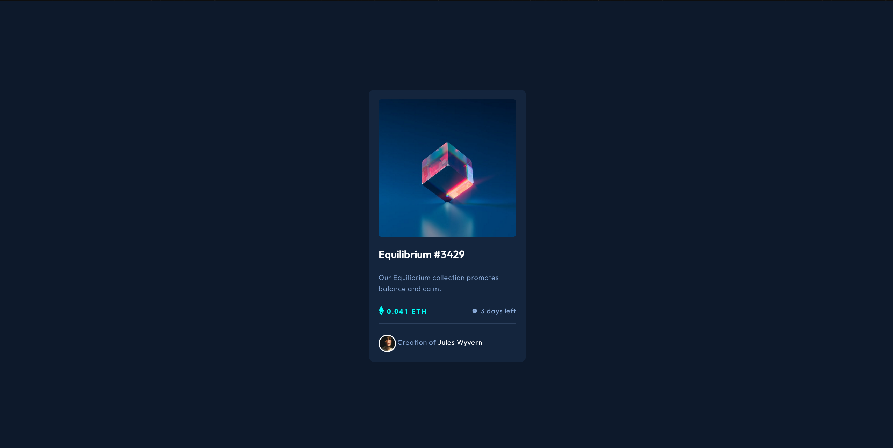

# Frontend Mentor NFT preview card component

This is a solution to the [NFT preview card component](https://www.frontendmentor.io/challenges/nft-preview-card-component-SbdUL_w0U) on Frontend Mentor. Frontend Mentor challenges help you to improve your coding skills by building realistic projects.

## Table of contents

- [Overview](#overview)
  - [The challenge](#the-challenge)
  - [Screenshot](#screenshot)
  - [Links](#links)
- [My process](#my-process)
  - [Built with](#built-with)
  - [What I learned](#what-i-learned)
  - [Useful resources](#useful-resources)
- [Author](#author)

## Overview

### The challenge

Users should be able to:

- View the optimal layout depending on their device's screen size
- See hover states for interactive elements

### Screenshot

### Links

- Solution URL: [Frontend Mentor Solution](https://www.frontendmentor.io/solutions/nft-card-preview-using-html-css-js-y4CUD31KWp)
- Live Site URL: [Live Site at Vercel](https://nftcardpreviewcyanide.netlify.app/)

## My process

### Built with

- Semantic HTML5 markup
- CSS custom properties
- Tailwindcss
- Flexbox
- Responsive Design

### What I learned

To create a card with with responsive design and hover effects

## Author

- Github - [correlucas](https://github.com/xCyanidex/NftCardPreview)
- Frontend Mentor - [@correlucas](https://www.frontendmentor.io/profile/xCyanidex)
